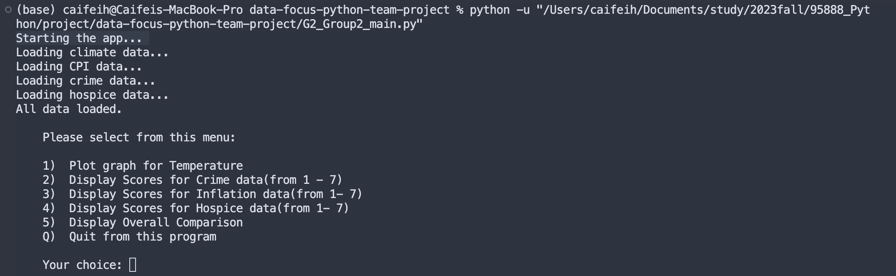
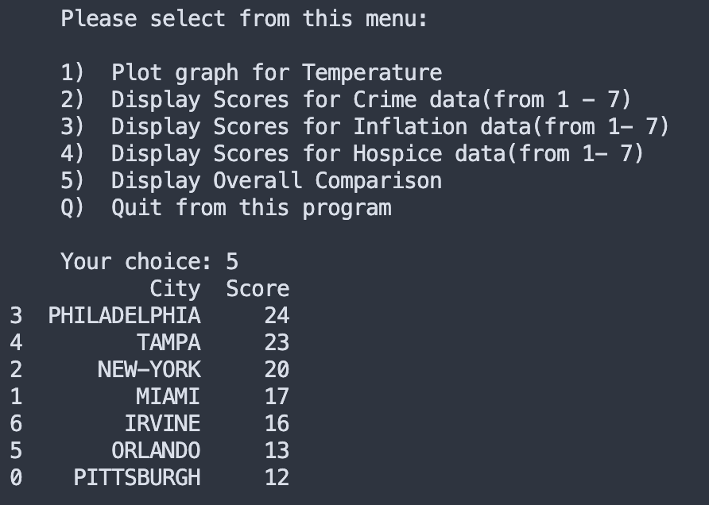

# Data Focused Python Team Project

# Team Members
* Caifei Hong (caifeih)
* Kefan Li (kefanli)
* Kane Shen (yuqingsh)
* Evelyn Sun (yumengs)

# How to Install and Run
Open the code folder, run `G2_Group2_main.py` file. The application will first show "Starting the app..." and then start loading all the data necessary for the application. After all data are loaded, a user interface will show on the terminal (Figure 1).

Figure 1 Application Welcome Screen

User can enter the item number from the menu, or enter "Q" to quit the application. If the user input does not match any of the menu item, the application will simply ignore the input and show the menu again. 

# City Scores
The application calculates several scores for each city, including cirme, inflation, hospice, and an overall score. (For temperatures it will plot three diagrams showing the lowest, highest and average temperature of each city.) The app uses a ranking score system for easier decision making. Since we have seven cities in total, each city will receive a score from 1 to 7 to indicate its strength in one area. For crime rate, city with lowest crimate rate receives highest score. For inflation, city with the lowest inflation rate receives highest score. For hospice, city with the highest average hospice score receives the highest score. After these calculation, the app adds up three scores for each city and generate an overall score table for comparison (Figure 2).

Figure 2 Display Overall Comparison